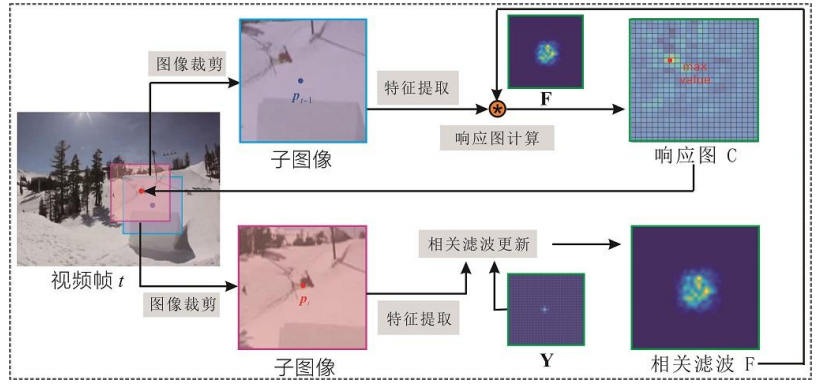

# 无人机和目标追踪

基于视觉的无人机目标跟 踪已成为最接近人类行为且最为直观的跟踪形式。

## 挑战

无人机视觉目标跟踪与地面目标跟踪相比，面 临着 4 个挑战

1) 由于空中视野广阔，干扰物体数 量较多，目标与其他物体之间、目标与背景之间相 互干扰，可区分性差，导致目标模型的可辨识性和 排他性不高，建立精准的目标模型较困难。
2)  当 无人机飞行在一定高度时，图像影幅变大，分辨率 和清晰度变低，地面上的待跟踪目标尺度变得很 小，目标特征和纹理变得稀少，使得目标特征提取 困难，特征表示不显著，导致目标检测和跟踪难度 变大。
3)  无人机在跟踪过程中易受到风力等外界 因素的影响，导致相机抖动、视角变化、运动模糊 等现象频繁，从而易产生跟踪漂移和丢失的情况，实现鲁棒、稳定、长时的无人机目标跟踪较为困 难。
4) 由于无人机自身结构特点，大多数无人机 仅有一个 CPU，计算资源有限，无法承受复杂度太 高的运算，如何在保证精度的情况下开发复杂度低 的跟踪算法是极具挑战的。随着无人机技术的发展 和计算机信息处理能力的提升，尽管无人机视觉目 标跟踪算法有了突破性进展，但由于上述难点的存 在，无人机视觉目标跟踪算法仍有很大的发展空间。

## 方法：

视觉 目 标 跟 踪 方 法 主 要 分 为 ：

### 生 成 类 跟 踪 方 法：

生成类跟踪方法 通常忽略背景信息的影响且假设目标外观在一定时 间内保持不变，故该方法无法处理和适应复杂的跟 踪变化

生成类目标跟踪算法将注意力放于目标本身，忽略了图像的背景信息，比较经典的算法有卡尔曼 滤波、粒子滤波、均值漂移等。

如：

卡尔曼滤波( Kalman filter，KF) 算法：

滤波去除噪声

解决，线性高斯问题，线性高斯问题就是（高斯分布的一种，*x*=A*z+b+ϵ）

x 是观测变量，
z 是潜在变量或输入变量，
A 是变换矩阵，描述了z到x的线性关系，
b是偏移量，
ϵ  是加性噪声，通常假设为高斯分布，即 ϵ ∼ N ( 0 , Σ )

### 判别类跟踪方法：

两种：基于相关滤波的，基于深度学习的

判别类跟踪方法，尤其是基于相关滤波和 基于深度学习的算法，在一定程度上解决了样本不 足的问题，且能够提取目标中更多有用信息，显著 提高目标跟踪准确率和速度。

由于 上述目标跟踪挑战的存在，判别类跟踪算法仍存在 一些不足。为了构建一个更精准、更高效且更鲁棒 的通用跟踪器，未来研究应重点关注高效的在线训 练和失跟后的重新检测机制，提高目标被完全遮挡 后的跟踪效果，同时，应关注如何引入迁移学习和 对抗学习等前沿方法来提高特征提取有效性，提高 算法对低分辨率的小目标的跟踪性能，从而应用于 机载无人机来完成实时跟踪任务

##### 基于相关滤波：

相关滤波跟踪算法是一种在线学习方法，能够及 时对模型进行更新，来适应目标的变化。

求解过程类似，主要 可分为 3 个阶段: 训练阶段、模型更新阶段和检测 阶段，大多数算法均采用岭回归方程进行求解：

在模型更新阶段，大多数相关滤波算法 会引入学习率 η，使用线性插值法对滤波器模型进 行更新：

在确定目标新位置之后，再根据新的目标 位置提取训练样本，接着再重复模型更新和目标检 测的步骤，达到跟踪每一帧目标的效果。响应图可 通过下边公式进行：

###### 具体算法以及各自的特点：

这些算法使用传统的特征提取方法，保证算法的跟踪速度。

1、最小输出误差平方和( MOSSE) 跟踪算法，相关滤波算法的核心问题是求解满足条件的滤波器

公式为：

表示为预测值与期望值的差值的平方，目标是使得这个值最小，w表示滤波器，与x进行卷积运算，在过程中转化到频域进行计算。

MOSSE 算法在目标跟踪领域 中具有里程碑的意义，它大大提高了目标跟踪的速 度，能够达到每秒 600 多帧，且在光照和目标姿态 的变化上具有较强的鲁棒性，减少了跟踪过程中的 目标漂移现象。

2、核相关滤波算法，KCF：

KCF 算法引入了 HOG 特征代替原有特征，并提 出了多通道样本的训练策略，将样本划分为若干个 区域，并对每个区域提取了 31 维特征。该算法对光 照变化等有较强的鲁棒性，跟踪速度快。

#### 基于深度学习：

MDNet 算法将 深度学习引入目标跟踪
SiamFC 算 法，真正打破了相关滤波在跟踪领域的垄断地位，利用全卷积孪生网络对跟踪数据进行端到端的训 练，结 构 简 单。

# 视频单目标跟踪

相关方法主要可以分为两类主要方向：

1）利用更加强有力的特征提取方法；

2）构建更加鲁棒的滤波器学习模型。

相关滤波视频目标跟踪算法主要包含以下 5

个步骤：

*步骤* *1* （搜索区域）：由于相邻两帧目标移

动范围有限，利用第 *t* - 1 帧的跟踪结果 ??− 1，通

过适当扩大 ??− 1 得到目标搜索区域，并在视频第

*t* 帧图像的上述搜索区域内进行目标定位搜索。

*步骤* *2*（特征提取）：用步骤 1 得到的第 *t* 帧

的搜索区域，对该区域内的图像进行特征提取，得

到特征图 **H**。

*步骤* *3* （目标定位）：相关滤波器 F 作用于

提取的特征图 H，利用下方公式得到响应图C
$$
C = H * F
$$
*步骤* *4*（滤波更新）：利用当前跟踪结果，如

下图下半栏所示，以目标为中心点截取子图像，

类似步骤 2 提取特征图 X，然后通过最小化公式

下列公式，求解相关滤波器 F
$$
E (F) =||X * F-Y||^2 +||F||^2
$$

*步骤* *5*（交替迭代）：令 *t* = *t* + 1，返回步骤 1

进行交替迭代。在视频每一帧重复上述步骤，可以

逐帧得到滤波器以及每帧目标的位置及尺寸，完成

视频目标跟踪任务。